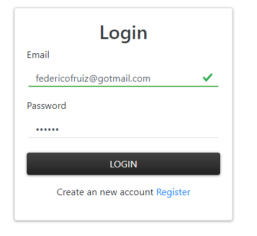
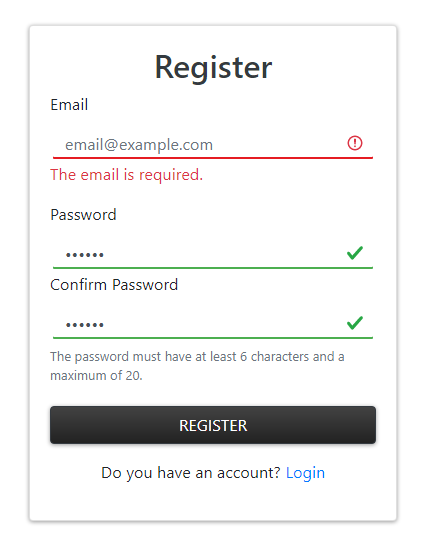

# Login-Angular9-Bootstrap4

<div class="row">
  


</div>


## Introduction 

The main purpose of this repository is to make a portfolio that help me to demostrate my skill and knowlage and maybe to get mi first job like **developer**. Perhaps in the future i will see this project and make a comparasion of how mauch i learned, but who knows... 

This is my first Angular 9 project, so no be rough with me 😬, is about an simple login/logout web app build with firebase.

## About the App ⚙

The login and register module has client side validation to improve the user experince.
I made an **inputController** class with the intention to re use in the future and respect the **GRAPS patterns**, 
precisely the Low coupling and High cohesion (make the componets really simple with low complex logic). The class has only two methods **checkInput** and **checkPasswordInput**.

I am goint to explain only the **checkInput** because are really similar, First at all we have an enum called **inpuState** created by me, this helped me to repressent the diferent states of an input text (idle, invalid, valid and empty) and managment it in the typeScript class and not in the HTML (help a lot to reduce unnecessary code). Then we have the logic of the input states.

```TypeScript
    public is = inputStates;

    checkInput(form: FormGroup, input: string) {
        if( form.controls[input].invalid && form.controls[input].touched && form.controls[input].value != '') {
            return inputStates.invalid;
          }else if(form.controls[input].valid){
            return inputStates.valid;
          }else if(form.controls[input].value == '' && form.controls[input].touched){
            return inputStates.empty;
          }else{
            return inputStates.idle;
          }
    }
```

The componet of Login has an inputState var called **emailOkey** that i use in the HTML to comunicate (with the help of Angular's directives) the diferents problems probably will have the user when he try to complete the fields and help him with a better UX.

```TypeScript
private ic = new inputController();

ngDoCheck() {
    this.emailOkey = this.ic.checkInput(this.loginForm,'email');
  }
```
  
  
```html
<div class="row">
    <div class="col-md-6 mx-auto mt-5">
        <div class="card">
            <div class="card-body">
                <h2 class="text-dark text-center">Login</h2>
                <form [formGroup]="loginForm" (ngSubmit)="onLogin()">                
                    <div class="form-group">
                        <label for="email">Email</label>
                        <input type="email" class="form-control form-control-custom" formControlName="email" ngModel email="true" required [ngClass]="{'is-valid' : emailOkey === is.valid,'is-invalid' : emailOkey === is.invalid || emailOkey === is.empty}">
                        <p *ngIf="emailOkey === is.empty" class="text-danger">The email is required.</p>
                        <p *ngIf="emailOkey === is.invalid" class="text-danger">This is not a valid email.</p>
                    </div>

                    <div class="form-group">
                        <label for="password">Password</label>
                        <input type="password" class="form-control form-control-custom" formControlName="password">     
                        <p class="text-danger" *ngIf="!emailAndPasswordOkey">The email, the password or both are wrong.</p>                    
                    </div>
        
                    <button type="submit" class="btn btn-dark btn-block">Login</button>
                </form>

                <div class="container text-center mt-3">
                    <p>Create an new account <a [routerLink]="['/register']">Register</a></p>
                </div>   
            </div>
        </div>
    </div>
</div>
```
 The component has a service called **auth** where we meke the connection with firebase and we use her classes and methods to do it.

```TypeScript
export class AuthService {

  public user: User;

  constructor(public afaouth: AngularFireAuth) { }

  async login(email:string, password:string) {
    try {
      const result = await this.afaouth.signInWithEmailAndPassword(email, password);
      return result;
    } catch (error) {
      console.log(error);
    }    
  }

  async register(email: string, password:string) {
    try {
      const result = await this.afaouth.createUserWithEmailAndPassword(email, password);
      return result;
    } catch (error) {
      console.log(error);      
    }    
  }

  async logout() {
    try {
      await this.afaouth.signOut();
    } catch (error) {
      console.log(error);      
    }    
  }

  getCurrentUser() {
   return this.afaouth.authState.pipe(first()).toPromise();
  }
}

```

With the Register component we have almost the same logic and structure with the difference of the confirm password field, so is unnecessary to explain.

## Photos 📷
Some photos of the login and Register Module.



